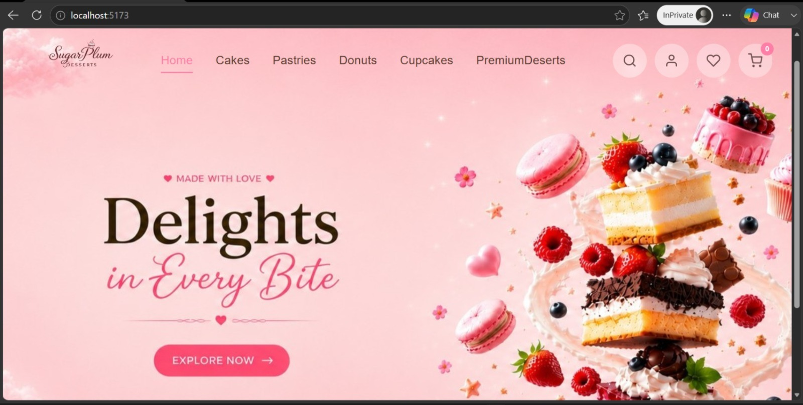
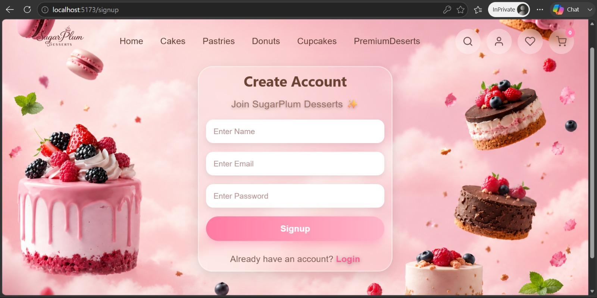
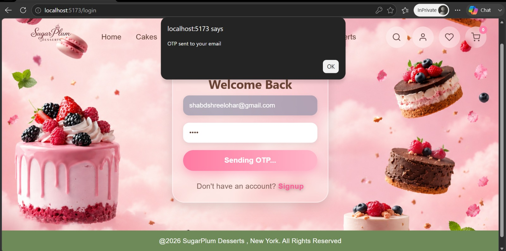
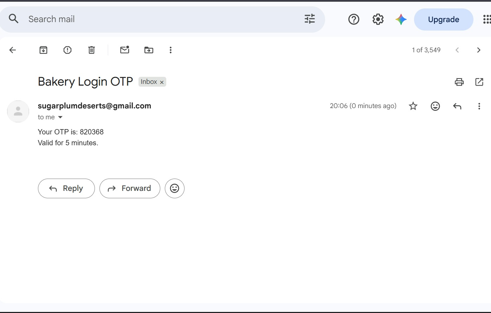
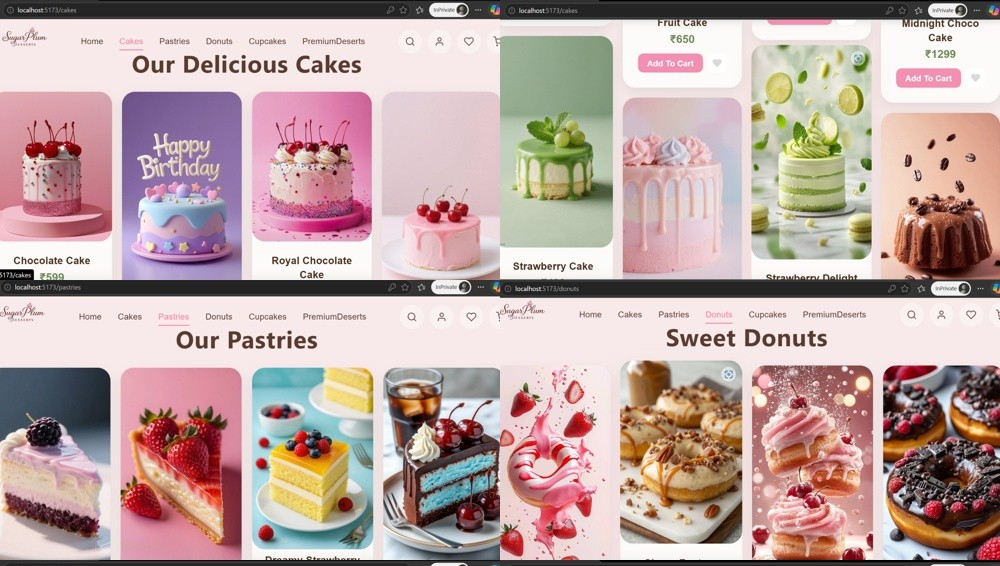
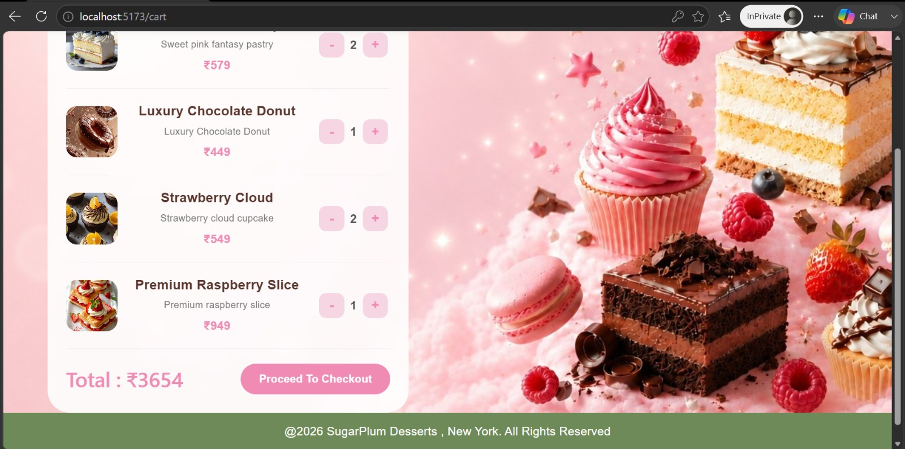
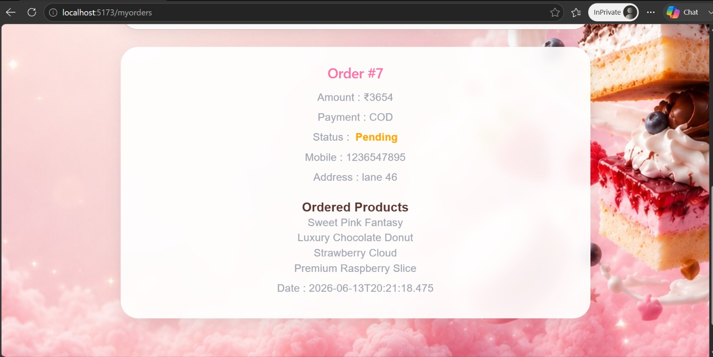
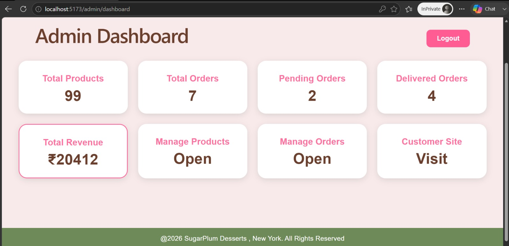
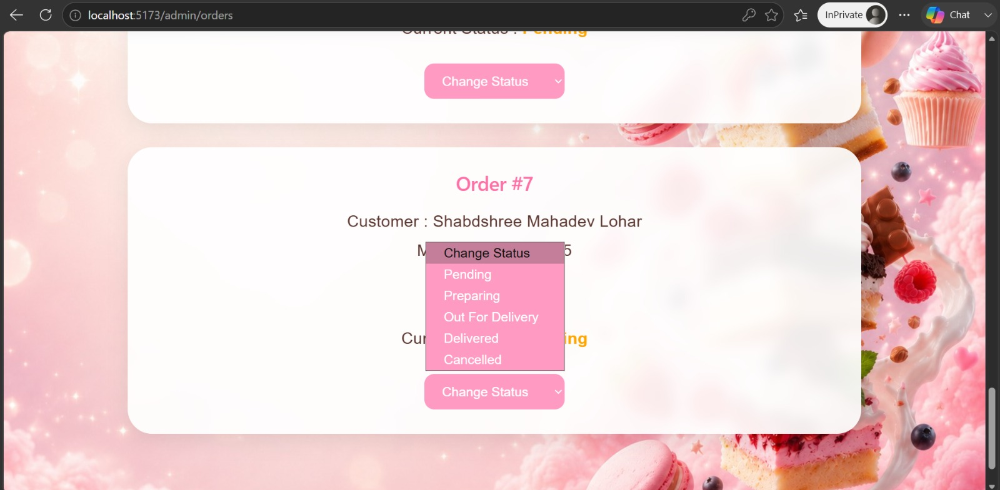

# 🍰 Sugarplum Desert's- Full Stack Bakery E-Commerce & Order Management System

## 📌 Project Overview
It is a commerceack e-commerce application developed using React.js, Spring Boot, Spring Security, and MySQL.

The platform allows customers to browse bakery products, manage shopping carts, place orders, maintain wishlists, and securely authenticate using OTP verification. An administrative dashboard enables efficient product and order management.

---

## 🚀 Key Features

* User Registration & Login
* OTP Verification
* Spring Security Authentication
* BCrypt Password Encryption
* Product Browsing
* Shopping Cart Management
* Wishlist Functionality
* Order Placement
* Order Tracking
* Admin Dashboard
* Product Management
* Order Management
* Responsive User Interface

---

## 🛠️ Tech Stack

### Frontend

* React.js
* React Router
* Axios
* HTML
* CSS
* JavaScript

### Backend

* Java 17
* Spring Boot
* Spring Security
* Spring Data JPA
* Hibernate
* Maven

### Database

* MySQL

### Tools

* Git
* GitHub
* Eclipse IDE
* VS Code

---

## 🏗️ System Architecture

React Frontend

⬇

REST APIs

⬇

Spring Boot Backend

⬇

Spring Security

⬇

MySQL Database

---

## 📸 Application Screenshots

### User Journey & Application Flow




















---

## ⚙️ Installation

### Clone Repository

```bash
git clone https://github.com/ShabdshreeLohar21/bakery-project.git
```

### Frontend Setup

```bash
npm install
npm run dev
```

### Backend Setup

```bash
cd backend

mvn clean install

mvn spring-boot:run
```

---

## 📂 Project Structure

```text
bakery-project
│
├── backend
│   ├── src
│   ├── pom.xml
│   └── Spring Boot Application
│
├── src
├── public
├── screenshots
│
└── README.md
```

---

## 🎯 Skills Demonstrated

* Full Stack Development
* REST API Development
* Authentication & Authorization
* Spring Security
* Database Design
* React Component Architecture
* State Management
* Version Control with Git & GitHub

---

## 👩‍💻 Author

Shabdshree Lohar

Java Full Stack Developer

Technologies:
Java • Spring Boot • Spring Security • React.js • MySQL • REST APIs
